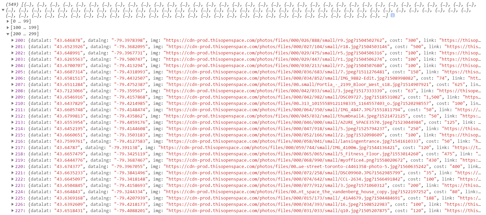

# online-marketplace-scraper
Scrape an online marketplace for their listings.

### Installation
Clone this repo to your machine
`https://github.com/radihuq/online-marketplace-scraper.git`

### Dependencies
This scraper uses the simple_html_dom_PHP library. You can find the [original project here](https://simplehtmldom.sourceforge.io/), or check out an [uploaded repo here.](https://github.com/samacs/simple_html_dom) 

### Usage
0. (Optional) uncomment & provide database credentials to write to database
1. Edit the `$file` variable with the website you wish to scrape.
2. Edit the `$pages` variable with the maximum number of pages you wish to scrape
3. Run the script

### Screenshot

### Limitations
This scraper was built for & tested on one online marketplace; it probably will not work with many other online marketplaces.

### Author
This scraper was created by Radiun Huq. You can reach him at:

`Email: radi@mrhuq.com`

`Twitter: @radiunhuq`